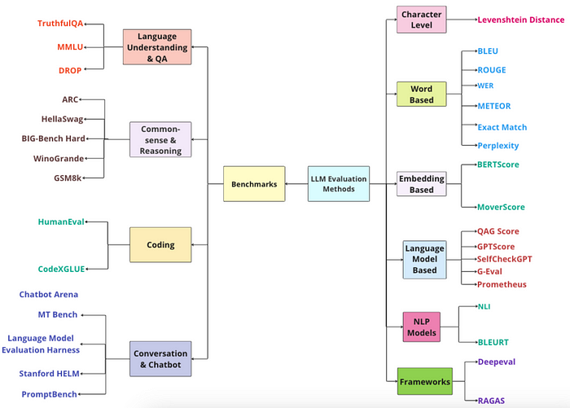
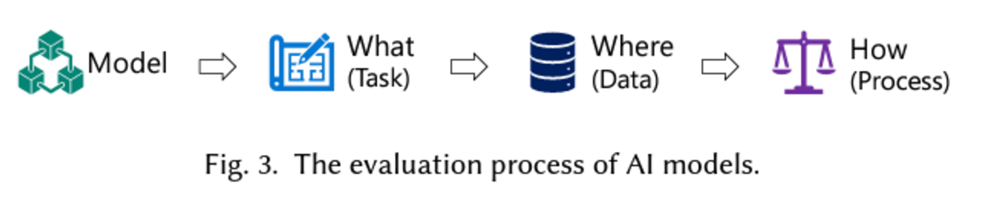
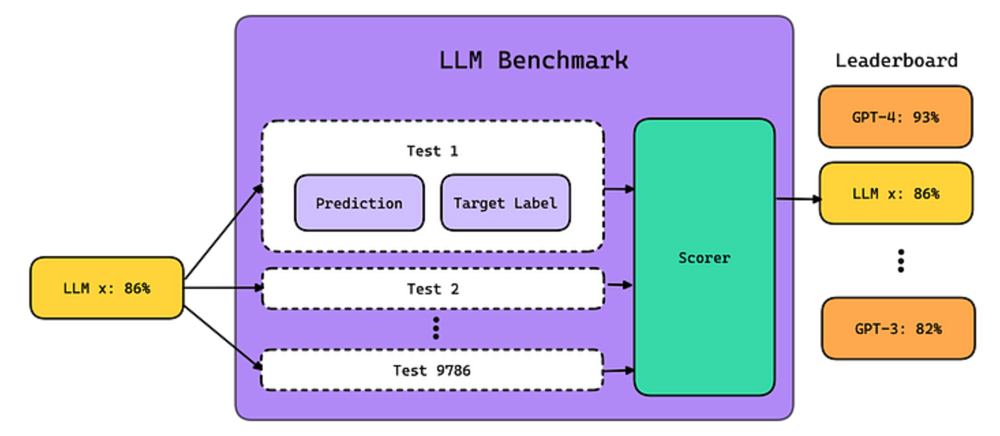
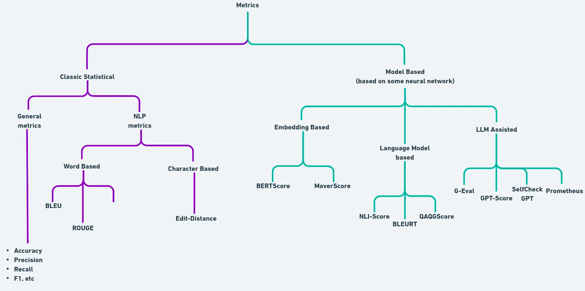

# Overview of Evaluation

### Evalutaion Process

## Benchmark vs Evaluation

| **Aspect**      | **LLM Benchmarking**                                                   | **LLM Evaluation**                                                  |
| --------------- | ---------------------------------------------------------------------- | ------------------------------------------------------------------- |
| **Purpose**     | Measures how well a model performs specific tasks using clear metrics. | Checks the overall abilities of the model in real-world situations. |
| **Focus**       | Specific tasks like understanding or generating text.                  | Real-world use, fairness, bias, and how reliable the model is.      |
| **Measures**    | Metrics like accuracy, F1-score, and perplexity.                       | Broader factors like fairness, robustness, and interpretability.    |
| **Use**         | Compares different models on specific datasets.                        | Checks if a model is suitable for practical and societal purposes.  |
| **Limitations** | Doesn’t look at real-world challenges like bias or fairness.           |                                                                     |

## What is LLM Benchmark?

LLM benchmarks are a set of standardized tests designed to evaluate the performance of LLMs on various tasks, such as reasoning and comprehension, and utilize specific scorers or metrics to measure these abilities.

### Scenario, Task, Benchmark Dataset, and Metric

“Scenario”, “Task”, “Benchmark Dataset”, and “Metric” are some frequently used terms in the evaluation space, so it is important to understand what they mean before proceeding.

#### Scenario

A scenario refers to a broad set of contexts, settings, or conditions under which an LLM's performance is assessed or tested. For example:

- Question Answering
- Reasoning
- Machine Translation
- Text Generation
- Natural Language Processing

### Task

- A task is a more specific evaluation of an LLM compared to a scenario.
- It defines exactly what the LLM is being tested on.
- A task can be made up of several sub-tasks.

**Example 1: Arithmetic Task**

- The task focuses on arithmetic questions.
- Sub-tasks can include Arithmetic Level 1, Level 2, etc.

**Example 2: Multiple Choice Task**

- This task involves multiple-choice questions.
- Sub-tasks can include history, algebra, etc.
- MMLU is an example that uses multiple-choice tasks.

### Metric

- A metric is a measure used to evaluate an LLM’s performance on specific tasks or scenarios.
- Metrics can be:

  1. **Deterministic function** (e.g., Accuracy) - A simple mathematical measure.
  2. **Score from a Neural Network/ML model** (e.g., BERT Score) - Generated using a model.
  3. **Score generated by LLM itself** (e.g., G-Eval) - Generated using the LLM’s own output.

### Benchmark Dataset

- A benchmark dataset is a standardized collection of test data used to evaluate LLMs for specific tasks or scenarios.
- Examples:

  - **SQuAD**: For question answering.
  - **GLUE**: For natural language understanding and Q&A.
  - **IMDB**: For sentiment analysis.

- A scenario can include multiple benchmark datasets, and a task can have several sub-tasks, each with its own dataset.
- Sometimes, a task may only have one benchmark dataset.

### Choosing the Right Benchmarks

- **Aligning with Objectives:** Ensure benchmarks match the tasks the LLM needs to perform.
- **Embracing Task Diversity:** Choose benchmarks that cover a variety of tasks for a complete evaluation.
- **Staying Domain-Relevant:** Select benchmarks that are relevant to the application, like language, text generation, or coding.

| **Name**                                        | **Published** | **Resources**                                                                                                                                                                                                                                               |
| ----------------------------------------------- | ------------- | ----------------------------------------------------------------------------------------------------------------------------------------------------------------------------------------------------------------------------------------------------------- |
| TruthfulQA                                      | 2022          | [Paper](https://arxiv.org/abs/2210.09261) ∙ [Code](https://github.com/sylinrl/TruthfulQA) ∙ [Dataset](https://arxiv.org/abs/2109.07958) ∙ [Demo Code](https://huggingface.co/datasets/lukaemon/mmlu)                                                        |
| MMLU (Massive Multitask Language Understanding) | 2021          | [Paper](https://arxiv.org/abs/2009.03300) ∙ [Code](https://github.com/hendrycks/test) ∙ [Dataset](https://huggingface.co/datasets/lukaemon/mmlu) ∙ [Demo Code](https://github.com/poorna1995/evalution/blob/master/mmlu/metric.ipynb)                       |
| ARC (AI2 Reasoning Challenge)                   | 2018          | [Paper](https://arxiv.org/abs/1803.05457) ∙ [Code](https://github.com/meetyou-ai-lab/can-mc-evaluate-llms) ∙ [Dataset](https://huggingface.co/datasets/allenai/ai2_arc) ∙ [Demo Code](https://github.com/poorna1995/evalution/blob/master/arc/metric.ipynb) |
| HellaSwag                                       | 2019          | [Paper](https://arxiv.org/abs/1905.07830) ∙ [Code](https://github.com/rowanz/hellaswag) ∙ [Dataset](https://huggingface.co/datasets/Rowan/hellaswag)                                                                                                        |
| BIG-Bench Hard (Beyond the Imitation Game)      | 2022          | [Paper](https://arxiv.org/abs/2210.09261) ∙ [Code](https://github.com/suzgunmirac/BIG-Bench-Hard) ∙ [Dataset](https://huggingface.co/datasets/maveriq/bigbenchhard)                                                                                         |

|
