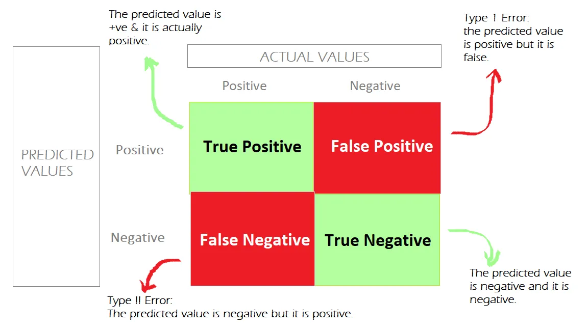
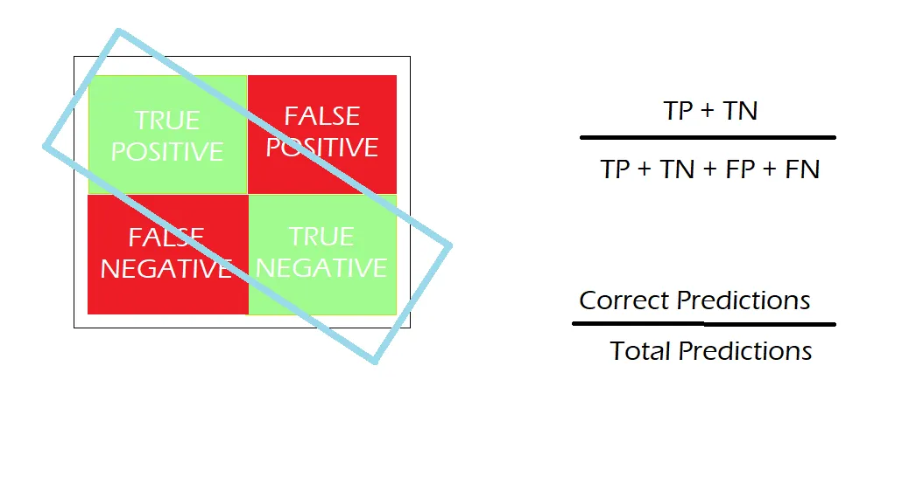
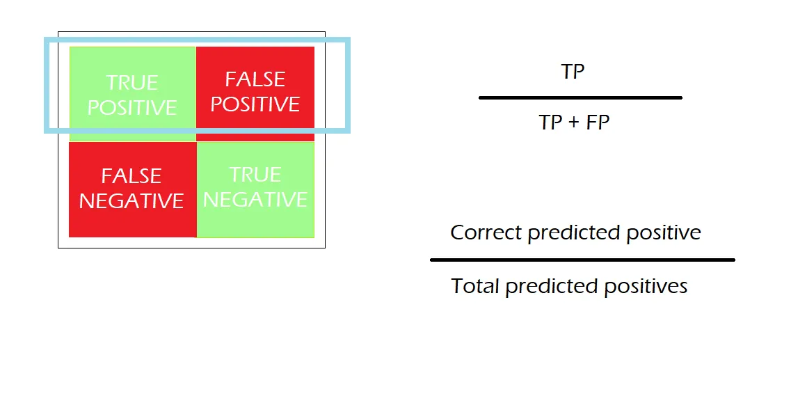
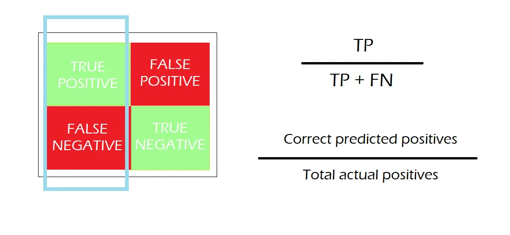
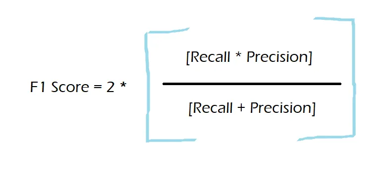

# Overview of Evaluation

### Evalutaion Process

## Benchmark vs Evaluation

| **Aspect**      | **LLM Benchmarking**                                                   | **LLM Evaluation**                                                  |
| --------------- | ---------------------------------------------------------------------- | ------------------------------------------------------------------- |
| **Purpose**     | Measures how well a model performs specific tasks using clear metrics. | Checks the overall abilities of the model in real-world situations. |
| **Focus**       | Specific tasks like understanding or generating text.                  | Real-world use, fairness, bias, and how reliable the model is.      |
| **Measures**    | Metrics like accuracy, F1-score, and perplexity.                       | Broader factors like fairness, robustness, and interpretability.    |
| **Use**         | Compares different models on specific datasets.                        | Checks if a model is suitable for practical and societal purposes.  |
| **Limitations** | Doesn’t look at real-world challenges like bias or fairness.           |                                                                     |

## What is LLM Benchmark?

LLM benchmarks are a set of standardized tests designed to evaluate the performance of LLMs on various tasks, such as reasoning and comprehension, and utilize specific scorers or metrics to measure these abilities.

<!--  -->

### Scenario, Task, Benchmark Dataset, and Metric

“Scenario”, “Task”, “Benchmark Dataset”, and “Metric” are some frequently used terms in the evaluation space, so it is important to understand what they mean before proceeding.

#### Scenario

A scenario refers to a broad set of contexts, settings, or conditions under which an LLM's performance is assessed or tested. For example:

- Question Answering
- Reasoning
- Machine Translation
- Text Generation
- Natural Language Processing

### Task

- A task is a more specific evaluation of an LLM compared to a scenario.
- It defines exactly what the LLM is being tested on.
- A task can be made up of several sub-tasks.

**Example 1: Arithmetic Task**

- The task focuses on arithmetic questions.
- Sub-tasks can include Arithmetic Level 1, Level 2, etc.

**Example 2: Multiple Choice Task**

- This task involves multiple-choice questions.
- Sub-tasks can include history, algebra, etc.
- MMLU is an example that uses multiple-choice tasks.

### Metric

- A metric is a measure used to evaluate an LLM’s performance on specific tasks or scenarios.
- Metrics can be:

  1. **Deterministic function** (e.g., Accuracy) - A simple mathematical measure.
  2. **Score from a Neural Network/ML model** (e.g., BERT Score) - Generated using a model.
  3. **Score generated by LLM itself** (e.g., G-Eval) - Generated using the LLM’s own output.

### Benchmark Dataset

- A benchmark dataset is a standardized collection of test data used to evaluate LLMs for specific tasks or scenarios.
- Examples:

  - **SQuAD**: For question answering.
  - **GLUE**: For natural language understanding and Q&A.
  - **IMDB**: For sentiment analysis.

- A scenario can include multiple benchmark datasets, and a task can have several sub-tasks, each with its own dataset.
- Sometimes, a task may only have one benchmark dataset.

### Choosing the Right Benchmarks

- **Aligning with Objectives:** Ensure benchmarks match the tasks the LLM needs to perform.
- **Embracing Task Diversity:** Choose benchmarks that cover a variety of tasks for a complete evaluation.
- **Staying Domain-Relevant:** Select benchmarks that are relevant to the application, like language, text generation, or coding.

| **Name**                                        | **Published** | **Resources**                                                                                                                                                                                                                                               | **Description**                                                                          |
| ----------------------------------------------- | ------------- | ----------------------------------------------------------------------------------------------------------------------------------------------------------------------------------------------------------------------------------------------------------- | ---------------------------------------------------------------------------------------- |
| TruthfulQA                                      | 2022          | [Paper](https://arxiv.org/abs/2210.09261) ∙ [Code](https://github.com/sylinrl/TruthfulQA) ∙ [Dataset](https://arxiv.org/abs/2109.07958) ∙ [Demo Code](https://huggingface.co/datasets/lukaemon/mmlu)                                                        | Evaluates LLMs' ability to generate factually truthful and accurate responses.           |
| MMLU (Massive Multitask Language Understanding) | 2021          | [Paper](https://arxiv.org/abs/2009.03300) ∙ [Code](https://github.com/hendrycks/test) ∙ [Dataset](https://huggingface.co/datasets/lukaemon/mmlu) ∙ [Demo Code](https://github.com/poorna1995/evalution/blob/master/mmlu/metric.ipynb)                       | Tests knowledge across 57 diverse subjects, focusing on zero-shot and few-shot accuracy. |
| ARC (AI2 Reasoning Challenge)                   | 2018          | [Paper](https://arxiv.org/abs/1803.05457) ∙ [Code](https://github.com/meetyou-ai-lab/can-mc-evaluate-llms) ∙ [Dataset](https://huggingface.co/datasets/allenai/ai2_arc) ∙ [Demo Code](https://github.com/poorna1995/evalution/blob/master/arc/metric.ipynb) | Assesses models' reasoning ability using grade-school science questions.                 |
| HellaSwag                                       | 2019          | [Paper](https://arxiv.org/abs/1905.07830) ∙ [Code](https://github.com/rowanz/hellaswag) ∙ [Dataset](https://huggingface.co/datasets/Rowan/hellaswag)                                                                                                        | Evaluates commonsense reasoning with next-sentence prediction in challenging contexts.   |
| BIG-Bench Hard (Beyond the Imitation Game)      | 2022          | [Paper](https://arxiv.org/abs/2210.09261) ∙ [Code](https://github.com/suzgunmirac/BIG-Bench-Hard) ∙ [Dataset](https://huggingface.co/datasets/maveriq/bigbenchhard)                                                                                         | Measures models' performance on complex reasoning tasks beyond standard benchmarks.      |
| GSM8k                                           | 2021          | [Paper](https://arxiv.org/abs/2110.14168) ∙ [Code](https://github.com/openai/grade-school-math) ∙ [Dataset](https://github.com/openai/grade-school-math) ∙ [Demo Code](https://github.com/poorna1995/evalution/blob/master/gsm8k/metric.ipynb)              | Presents grade-school math word problems to test multi-step mathematical reasoning.      |

### Confusion Matrix:

A confusion matrix is a visualization table that evaluates a classification model's performance by comparing predicted values with actual values.

- The **rows** represent predicted values.
- The **columns** represent actual values.

A typical confusion matrix has four main components:

- **True Positives (TP):** Correctly predicted positive cases.  
  _Example:_ 100 spam emails correctly identified out of 150 actual spam emails.

- **True Negatives (TN):** Correctly predicted negative cases.  
  _Example:_ 800 non-spam emails correctly identified out of 850 actual non-spam emails.

- **False Positives (FP):** Incorrectly predicted positive cases. Also known as Type 1 Error.  
  _Example:_ 50 non-spam emails incorrectly predicted as spam.

- **False Negatives (FN):** Incorrectly predicted negative cases. Also known as Type 2 Error.  
  _Example:_ 20 spam emails missed out of 150 actual spam emails.

### Confusion Matrix Analysis:

- **Diagonal Elements:**  
  The diagonal elements represent the counts of correctly predicted samples for each class. For example, the value at position (0, 0) represents the count of samples correctly predicted as class 0. The higher the values on the diagonal, the better the model’s performance for those particular classes.

- **Off-Diagonal Elements:**  
  The off-diagonal elements represent the misclassifications made by the model. Each element at position (i, j) indicates the count of samples from class i misclassified as class j. Lower values for off-diagonal elements indicate fewer misclassifications.

### Performance / Evaluation Metrics

A confusion matrix helps calculate various performance metrics to evaluate a model's effectiveness:

- **Accuracy:**  
  Accuracy measures how many predictions the model got right. It is calculated by dividing the number of correct predictions by the total number of predictions. Accuracy is useful when the classes in the dataset are balanced (i.e., each class is equally represented).

---

- **Precision:**  
  Precision measures how accurately a model predicts the positive class.

  **Precision** is important when **False Positives** are more concerning than False Negatives. For example, in medical diagnosis or spam detection, where incorrect positive predictions can have serious consequences.

---

**Recall (Sensitivity / True Positive Rate):**  
 Recall measures how many actual positive observations are correctly predicted as positive. It is also known as **Sensitivity** and is used when we want to capture as many positives as possible.

**Recall** is crucial when **False Negatives** are more critical than **False Positives**. For example, in disease detection or fraud detection, where missing a positive case (false negative) can have serious consequences.

---

**F1-Score:**  
 The F1-score is the harmonic mean of **precision** and **recall**, providing a balanced measure that combines both. It is useful when both precision and recall are equally important, especially in cases of class imbalance.

The F1-score helps find a trade-off between precision and recall. If either precision or recall is low, the F1-score will also be low. Ideally, the F1-score should be as high as possible (close to 1).

Summary:

- Accuracy is a better metric for Balanced Data.
- Whenever False Positive is much more important use Precision.
- Whenever False Negative is much more important use Recall.
- F1-Score is used when the False Negatives and False Positives are important.
- F1-Score is a better metric for Imbalanced Data.
- The ideal value for Accuracy, Precision, Recall (Sensitivity), Specificity, F1
